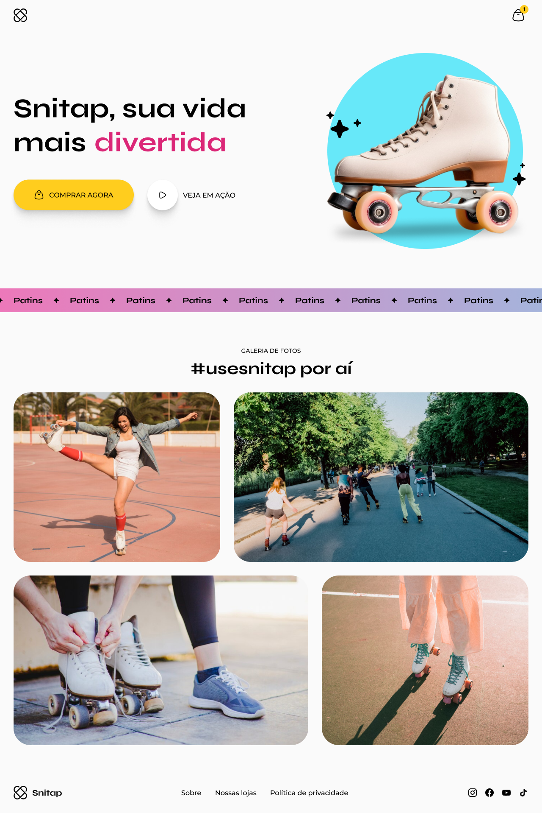

<h1 align="center"> Landing Page - Snitap </h1>

Projeto feito junto as aulas da trilha fullstack da Rocketseat.

<a href="#-tecnologias">Tecnologias</a>&nbsp;&nbsp;&nbsp; |&nbsp;&nbsp;&nbsp;&nbsp;
<a href="#-projeto">Projeto</a>&nbsp;&nbsp;&nbsp;|&nbsp;&nbsp;&nbsp;
<a href="#-layout">Layout</a>&nbsp;&nbsp;&nbsp;|&nbsp;&nbsp;&nbsp;

## 🚀 Tecnologias

Esse projeto foi desenvolvido com as seguintes tecnologias:

- HTML;
- CSS (animations & transitions);
- Media Queryes;
- Git e Github;
- FIGMA;

## 💻 Projeto

A landing page, foi uma página feita para estudar as animações do css, utilizamos muito de transições e @keyframes, para fazer a página; e também como forma de desafio, deixa a página toda responsível e adequada a mobile's.

## 📘 Projeto feito como forma de estudos

Esse projeto foi feito como formato de estudos em colaboração com a Rocketseat.git